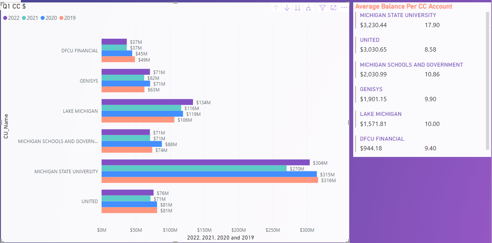
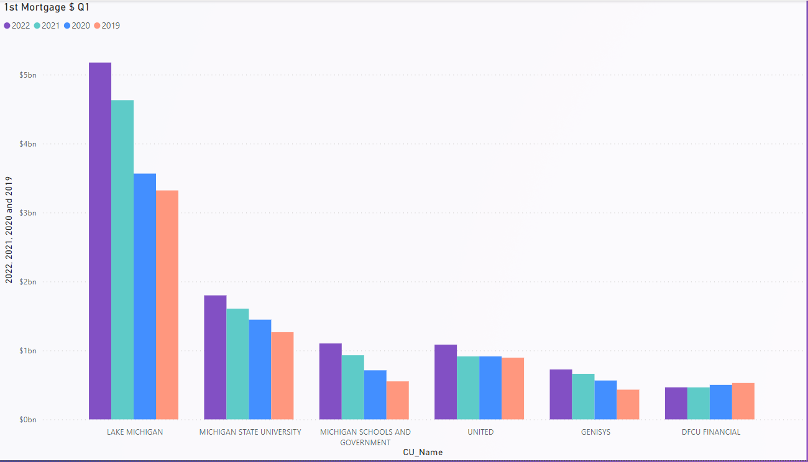

# CU Analysis

## Overview
Analyze credit union data on the National Credit Union Administation's website and provide recommendations for MSUFCU.  MSUFCU is the second largest credit union in the state of Michigan with total assets of $6.8B, as of March 2022.  The credit union is on track to reach $10B in total assets in the next few years.  Currently, there are only 19 credit unions within the U.S. that have reached over $10B in total assets and only one credit union located in Michigan.  MSUFCU is poised to be the 2nd credit union within Michigan to achieve this level.

## Results
### Credit Cards
MSUFCU has a significant number of unsecured credit card loans in their lending portfolio. 38.7% of the total number of loans is comprised of credit cards.  The delinquency in this portfolio is quite low at 0.52%.  Credit cards have rebounded for MSUFCU over Q1 2021, which saw a substantial downturn from Q1 in 2020 and 2019.  This appears to be consistent with Michigan credit unions over $3B in assets.

MSUFCU members tend to carry a higher balance, despite MSUFCU reporting the highest interest rate of the measured credit unions.  In fact, the Q1 interest rate is 800 basis points higher than the reported Q1 2021 rate for MSUFCU.  It is unknown if this is a reporting error or an intentional rate increase.  If the rate increase was intentional, then it would indicate that members are likely using the MSUFCU credit card for value added benefits despite the higher rate.  Yet, it may also be a deterent for many as MSUFCU has over $1B in unfunded credit card lines.

With only 22.7% of available credit card lines being utilized, this is an area where MSUFCU can focus to increase dollars on these lines.  Increasing the total lines utilized by just 100 basis points would bring MSUFCU back to and even exceeding prior balances from 2020 and 2019.  With the low portfolio delinquency, this is an area that seems to be a reasonable risk for MSUFCU.  MSUFCU should consider providing credit line increases to qualifying members who are active users of the product, reviewing underwriting guidelines to potentially take on more deeper credit risk, continued marketing of the strong value added benefits of the program, and even re-evaluating any staff incentive for credit card sales.

### First Mortgages
MSUFCU has seen a steady increase in first mortgage loans in recent years.  It is unknown if this is due to new purchases or refinances from competitors.  They have continued to add appoximately $100M to the portfolio year over year in Q1 reports.

The current average 1st mortgage amount is $136,676 for MSUFCU whereas Lake Michigan has an average loan amount of $189,991.  MSUFCU's delinquency in this portfolio is quite low, as is Lake Michigan's.  MSUFCU's reported Q1 rate is 50 basis points higher than Lake Michigan's.  MSUFCU has a tremendous opportunity to increase loan dollars through this portfolio.  It may be necessary to evaluate the effectiveness of the products offered under the portfolio, keeping more loans on the books instead of selling to the secondary market, continuing to review the pricing mix to attract higher loan amounts, and considering taking on deeper risks in underwriting guidelines.  

## Summary
MSUFCU is a market leader within the industry and state.  They are leaders in the auto lending space among credit unions.  The overall delinquency rate for MSUFCU is low.  Two areas to improve upon are the credit card and first mortgage products.  The challenge is finding the right mix to entice current and potential members to move dollars into these products.  However, increases in both of these products would yield significant results to the net income.